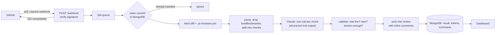

# PR Reviewer

A GitHub App that reviews pull requests with an LLM. When a pull request is opened or updated, it reads the diff,
asks Claude for findings, checks every finding against the diff, and posts them as **inline review comments** on
the exact lines. A dashboard shows every review, its comments, cost in tokens, and trends.

**Stack:** Node 22 + TypeScript (Express, Octokit) · MongoDB · Anthropic API · React + TypeScript (Vite, client-side rendered) · Docker Compose · GitHub Actions

Setup for a real GitHub App: [SETUP.md](docs/SETUP.md).

## How a review works



1. **Webhook.** GitHub sends `pull_request` events (opened, synchronize, reopened, ready_for_review). The
   handler verifies the HMAC signature, enqueues the work and answers `202` at once, because GitHub gives up
   after 10 seconds and a review takes longer.
2. **Claim.** The review is recorded under a unique key (owner, repo, PR number, commit SHA). A duplicate or
   redelivered webhook for the same commit finds the key taken and does nothing.
3. **Prepare.** The diff is parsed into files, hunks and lines, tracking each line's number in the new file.
   Lockfiles, minified/generated files, images and deleted files are dropped. What is left is split into chunks
   that fit the model's budget; every line is shown to the model with its line number.
4. **Review.** Each chunk goes to Claude with instructions and a forced `submit_review` tool call, so the answer
   is structured data, not prose to be parsed.
5. **Validate.** Every finding is checked before it is posted: well-formed, on a line that is really part of the
   diff, above the configured severity, not already posted on an earlier push, within the comment limit.
6. **Post.** One GitHub review with a summary and inline comments. If GitHub rejects a line position (422), the
   findings are posted as a plain-text review instead of being lost.

## Repo settings: `.pr-reviewer.yml`

Optional file at the root of a reviewed repository (all keys optional):

```yaml
enabled: true
ignore: ["docs/**", "**/*.generated.ts"]   # extra globs to skip
focus: [security, error handling]           # areas to emphasise
instructions: "We use Result types, not exceptions."
minSeverity: warning          # suggestion | warning | critical
maxComments: 10               # 1-50, most severe kept first
reviewDrafts: false
```

A broken file never blocks a review: defaults are used and the problem is mentioned in the review summary.
Adding the label `no-ai-review` to a pull request skips it. Pull requests from bots are skipped.

## Design decisions and trade-offs

**Structured output through a forced tool call.** Asking a model for JSON in prose fails in small, annoying ways
(extra text, trailing commas). A required tool with a JSON schema makes the reply data. Even so, nothing the model
returns is trusted: each finding is validated (see below).

**Validate against the diff, because GitHub is strict.** A review comment on a line that is not in the diff makes
GitHub reject the *whole* review with 422. Models get line numbers wrong sometimes. So the app shows the model
numbered lines, then drops any finding whose path/line is not a changed or context line. The cost is the occasional
lost finding; the alternative is losing entire reviews.

**Deduplicate by content, not by line.** After a new push, lines shift, so the same remark would land on a new
line number and be posted again. Each comment gets a fingerprint (hash of file + normalised text, ignoring the
line), and fingerprints of comments already posted on the PR are skipped. Trade-off: if the same issue really
appears in two places in one file with identical wording, only the first is reported.

**Untrusted input.** The PR title, description and code are written by other people and could contain "ignore your
instructions" text. They are placed inside tagged blocks and the system prompt says to treat them as data. This
lowers the risk, it does not remove it. The model has no tools that act on the world (its only tool just returns
findings), so the worst case is a bad or misleading comment, not an action.

**Idempotency through a unique key.** GitHub retries and redelivers webhooks. Instead of a lock, the database's
unique index on (repo, PR, commit) decides who owns a review, so it also holds when several instances run.
Failed, skipped (e.g. draft) and stuck runs (older than 15 minutes) can be claimed again.

**In-process queue.** A small bounded queue keeps the webhook fast and limits concurrent reviews. The cost is that
queued work is lost if the process dies; the claim record plus GitHub redelivery covers most of that. For
production scale, replace it with a durable queue (SQS, BullMQ on Redis, ...). The interface is one class.

**Big pull requests.** Files are packed into chunks; a single huge file is split at line boundaries with its header
repeated. There is a total budget (`MAX_DIFF_CHARS`); chunks beyond it are dropped and the review says so instead of
silently reviewing part of the change. Chunks are reviewed in parallel (3 at a time). Trade-off: the model sees
one chunk at a time, so it can miss problems that span chunks.

**Partial failure.** If some chunks fail (rate limit, outage) the rest still produce a review and the summary
names the gap. Only if every call fails is the review marked failed (and it can be retried on redelivery).

**Dashboard auth.** One shared bearer token, compared in constant time. Simple and honest for a single-team tool;
it is not per-user auth. The token is kept in `sessionStorage`, so it goes away when the tab closes.

**No comment when clean.** A review with nothing to say posts nothing, to avoid noise on every push. The dashboard
still records the run.

## Known limits

- One shared dashboard token, no roles.
- Statistics are computed from the latest 1,000 reviews in memory; use aggregation queries beyond that.
- Only the diff is sent. The model does not see the rest of the repository, so it cannot judge code it cannot see.
- Cost is proportional to diff size. The dashboard shows tokens per review; cap it with `MAX_DIFF_CHARS`.
- LLM output is probabilistic. Treat comments as suggestions from a second reviewer.

## Tests

`npm test` runs both suites (`npm run test:coverage` adds a coverage report and enforces the floors).

**Backend, 99 tests (~92% of statements).** Diff parsing (renames, new/deleted/binary files, multiple hunks, odd
whitespace), file filtering, chunking, comment validation and dedupe, repo config parsing, the whole review flow with a
fake GitHub and fake model (skips, retries, 422 fallback, partial failures, idempotency), webhook signature
verification and the HTTP API, the Anthropic request/response handling (through the SDK with a fake `fetch`), the
GitHub client adapter, settings loading, the job queue and statistics. The MongoDB store tests run when `MONGO_TEST_URI`
is set (CI does this), so a local run reports lower coverage for that file.

**Frontend, 36 tests (~99% of statements).** Rendered with React Testing Library against a fake API: the sign-in gate
(wrong, right and expired tokens), overview numbers and empty/error states, the chart (bars, peak label, tooltip, table
view), the reviews list with filters and pagination, the detail page, and the theme switch.

Coverage floors live in each package's Vitest config. They sit a little below today's numbers, so they catch a real drop
without failing on noise.

## Code quality and git hooks

| Tool                                         | What it does                                                  |
| -------------------------------------------- | ------------------------------------------------------------- |
| ESLint (`npm run lint`)                      | Catches real bugs: unused code, hook misuse, unsafe patterns  |
| Prettier (`npm run format` / `format:check`) | One code style, no formatting debates                         |
| Husky + lint-staged                          | On every commit: fix and format the staged files              |
| Husky pre-commit                             | Then typecheck and run all tests; a failure blocks the commit |
| commitlint                                   | Commit messages must follow Conventional Commits (`feat: …`)  |

Hooks install themselves with `npm install` at the repository root (`npm run install:all` does that plus both
packages). They are a convenience, not a gate: `--no-verify` skips them, so CI runs the same lint, format, typecheck and
test checks on every push and pull request.

## Project layout

```
backend/                Express API, webhook handler, review pipeline, MongoDB store
frontend/               React dashboard (Overview, Reviews, Review detail)
docs/SETUP.md           Register the GitHub App and run everything
docker-compose.yml      mongo + backend + frontend
.github/workflows/      CI: lint, format, tests + coverage, builds, Docker image builds
.husky/                 Git hooks (pre-commit, commit-msg)
package.json            Repo tooling and shortcuts: install:all | dev:backend | dev:frontend | lint | format | test | build | clean
eslint.config.mjs, .prettierrc.json, commitlint.config.mjs   Tooling configuration
```

Run locally: see [docs/SETUP.md](docs/SETUP.md).
